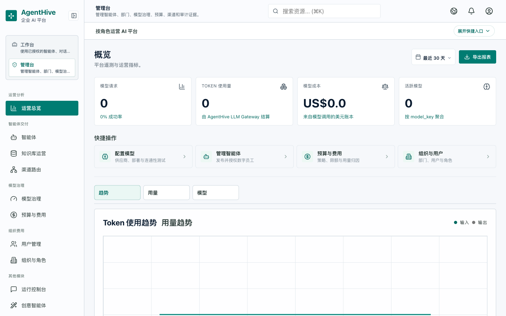
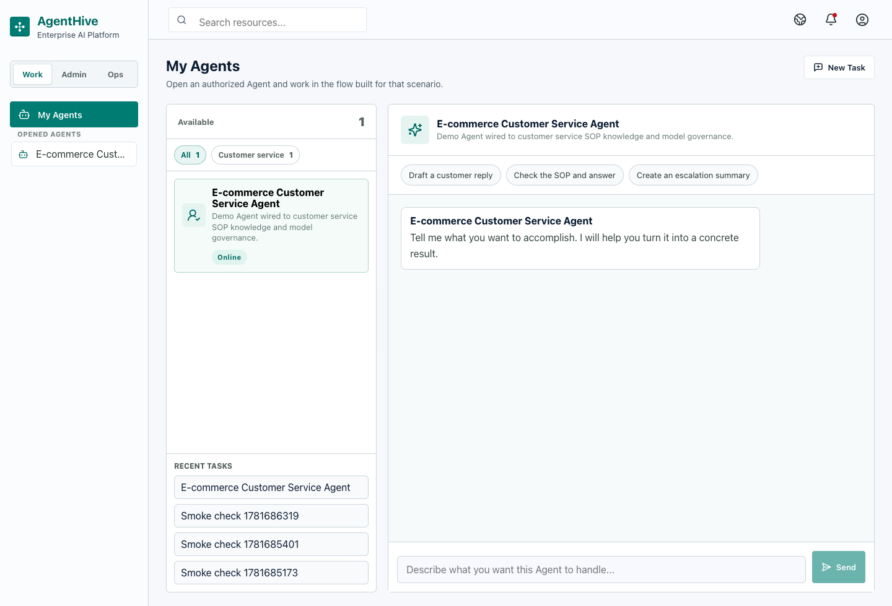
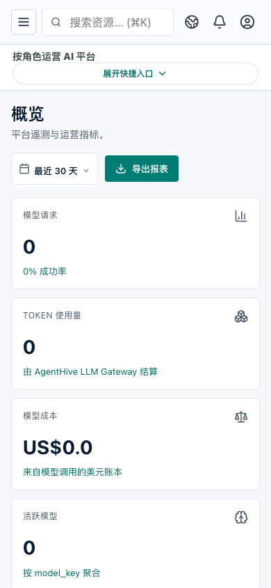
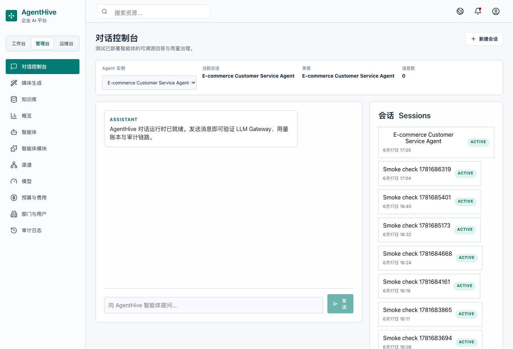
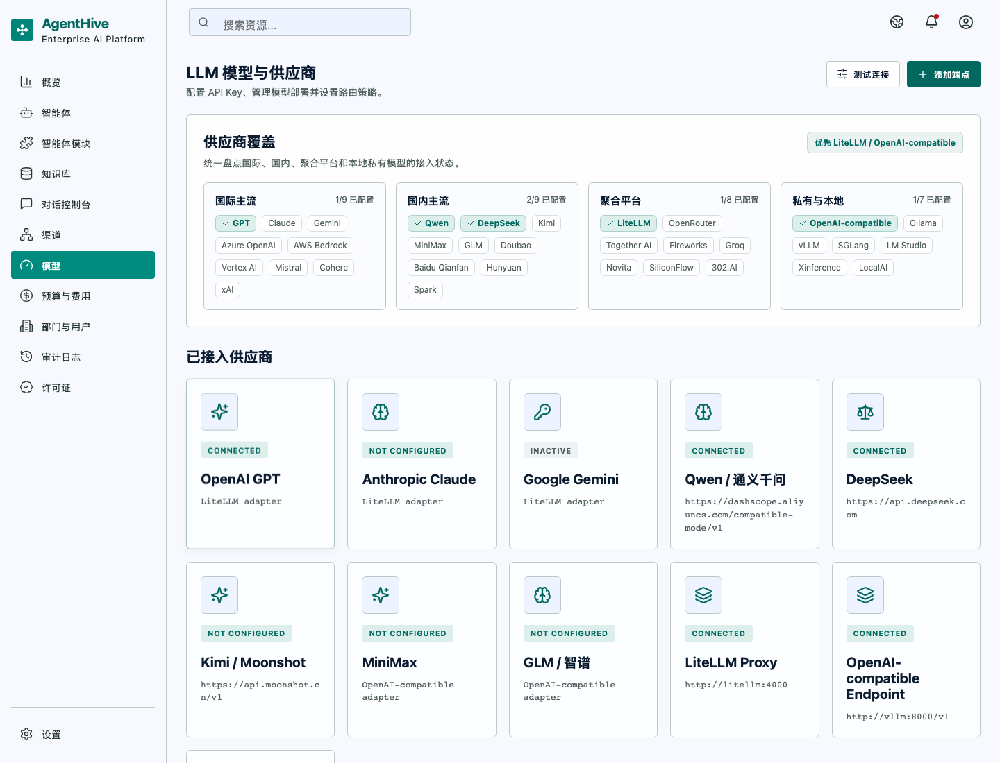
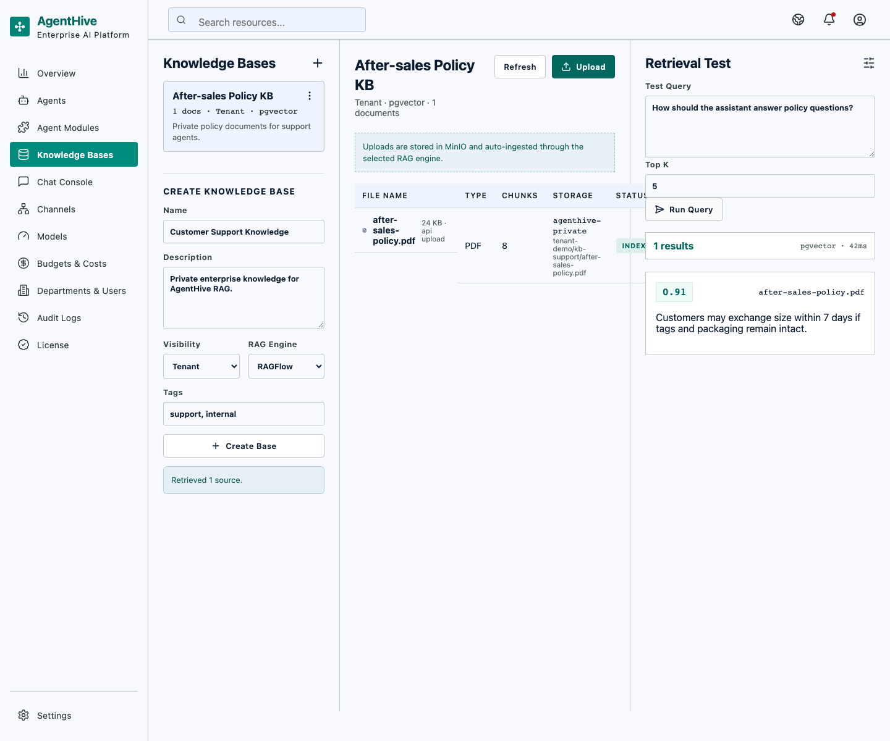

# AgentHive

**AgentHive** 是面向中小企业的私有化企业 AI 平台，让每一个岗位都能拥有一个可治理、可审计、可持续交付的 AI 同事。

AgentHive 把 Agent、知识库、模型供应商、预算、渠道、组织权限和运行审计放在同一个企业工作台里。它支持 Docker Compose 私有部署，业务数据默认留在客户自己的 PostgreSQL、MinIO 和 Redis 环境中。

[](https://github.com/ToBeWin/AgentHive/actions/workflows/ci.yml)
[](https://github.com/ToBeWin/AgentHive/actions/workflows/codeql.yml)
[](https://github.com/ToBeWin/AgentHive/releases)
[](./LICENSE)

## 产品状态

| 项目 | 当前值 |
| --- | --- |
| 版本 | `v0.3.0-alpha.3` |
| 发行阶段 | Alpha，适合技术评估、私有化试点和二次开发 |
| 产品完成度 | 约 82%，核心 MVP 闭环已形成，生产 GA 能力仍在收敛 |
| 默认部署 | 单体 FastAPI + React，Docker Compose 一键启动 |
| 默认语言 | 简体中文、English |

这个版本已经具备企业 AI 平台的主要骨架和可运行验证证据，但不宣称已经完成所有客户现场交付要求。正式上线前仍需针对目标客户完成供应商连通性、容量、TLS、备份恢复、灾备和安全验收。

## 系统截图

### 运营概览与角色化工作台

| 管理台概览 | 数字员工工作台 |
| --- | --- |
|  |  |

### 移动端与企业 AI 能力

| 移动端概览 | 对话控制台 |
| --- | --- |
|  |  |

| 模型治理与供应商覆盖 | 知识库与检索测试 |
| --- | --- |
|  |  |

截图来自项目现有的浏览器验收产物，示例数据均为本地演示数据，不代表任何真实客户信息。

## 核心能力

- **统一企业 Web 端**：管理员、运维、模型管理员、Agent 管理员、部门领导、审计/财务和普通员工通过同一入口工作。
- **Agent 目录与实例**：官方 Agent 模块可安装、启用、停用、授权和审计；实例可绑定模型路由、知识库、部门和渠道。
- **模型治理**：供应商、Base URL、凭据、模型部署、能力标签、fallback、连接测试、live probe、价格和预算策略集中管理。
- **LLM Gateway**：所有模型调用经过统一策略、预算、路由、用量、费用和审计链路，并按部署提供熔断与恢复探测。
- **知识库与 RAG**：文件上传、MinIO 对象存储、PostgreSQL 元数据、pgvector 检索，以及可替换的 RAGFlow Adapter。
- **预算与费用**：支持租户、部门、成本中心、人员、Agent、Channel 和模型维度的限制、预警、费用账本和导出。
- **多渠道接入**：企业微信、钉钉、飞书、Web Widget、REST API 和通用 Webhook 通过统一消息网关接入。
- **媒体生成网关**：图片/视频生成任务具备异步任务、参考素材、产物存储、权限、预算和审计边界。
- **企业级运维**：License、部署指纹、组件健康、readiness、诊断支持包、备份恢复、升级脚本和 CodeQL/Dependabot。
- **国际化**：默认支持 `zh-CN` 与 `en-US`，界面文案和管理流程按企业场景组织。

## 技术架构

```text
企业微信 / 钉钉 / 飞书 / Web Widget / REST API
                    │ UnifiedMessage
                    ▼
             Channel Gateway
                    │
                    ▼
        FastAPI 单体应用 + React Web
          ┌─────────┼─────────┐
          ▼         ▼         ▼
       Auth/RBAC  Agent      Admin API
          │       Runtime       │
          └─────────┼───────────┘
                    ▼
        Policy / Budget / Audit / Cost
                    │
       ┌────────────┼────────────┐
       ▼            ▼            ▼
   LLM Gateway   RAG Adapter   Media Gateway
       │            │            │
   LiteLLM /    pgvector /     MinIO / Celery
   compatible   RAGFlow
                    │
         PostgreSQL + Redis + MinIO
```

### 技术栈

| 层 | 技术 |
| --- | --- |
| 前端 | React 19、TypeScript、Vite、Tailwind CSS、shadcn/ui、Lucide、Zustand、TanStack Query |
| 后端 | Python 3.12、FastAPI、SQLModel、Alembic、LangGraph、LangChain |
| 模型治理 | AgentHive LLM Gateway、LiteLLM、OpenAI-compatible Adapter、Provider Adapter |
| 数据与任务 | PostgreSQL 16 + pgvector、Redis 7、Celery、MinIO |
| 质量与安全 | Vitest、Playwright、Pytest、Ruff、Mypy、Biome、Gitleaks、CodeQL、Dependabot |
| 部署 | Docker 27+、Docker Compose v2、Nginx |

## 快速开始

### 方式一：Docker Compose 开发环境

要求：Docker 27+、Docker Compose v2。

```bash
cp .env.example .env
docker compose -f docker-compose.dev.yml up -d --build
```

打开 `http://localhost:8080`。首次启动可以使用浏览器里的 Prototype Mode 做前端体验，也可以初始化本地数据库并加载演示租户：

```bash
docker compose -f docker-compose.dev.yml exec backend python scripts/init_db.py
docker compose -f docker-compose.dev.yml exec backend python scripts/seed_demo.py
docker compose -f docker-compose.dev.yml exec backend python scripts/check_db.py
```

演示账号：

```text
Tenant slug: demo
Email: admin@example.com
Password: AgentHive123!
```

演示数据只用于本地评估、销售演示和集成测试，不要直接用于客户生产环境。

### 方式二：前端本地开发

要求：Node.js `22.x`。

```bash
cd frontend
npm install
npm run dev
```

前端默认运行在 `http://localhost:5173`。要连接真实后端，请先启动开发 Compose 基础设施或按照 [远程基础设施开发指南](./docs/remote-infra-dev.md) 配置隧道。

### 方式三：私有化安装

生产安装需要客户自己的 HTTPS 入口、License 公钥和密钥配置：

```bash
scripts/install.sh \
  --license-public-key ./agenthive_license_public.pem \
  --public-base-url https://agenthive.example.com \
  --start
```

生产 Compose 的 HTTP origin 默认只监听 loopback，应由同机 TLS 终止层代理。License、公钥、API Key、Webhook Secret 和数据库密码都不应提交到 Git。

更多部署、升级、备份和恢复说明见 [私有化部署指南](./docs/deployment.md)。

### 可选：Prometheus 与 Grafana

可观测性栈是独立的可选组件，Grafana 密码必须显式提供，不使用仓库内置默认密码：

```bash
GRAFANA_ADMIN_PASSWORD='replace-with-a-strong-password' \
  docker compose -f observability/docker-compose.observability.yml up -d
```

Grafana 和 Prometheus 默认只绑定 `127.0.0.1`。如需远程访问，请在客户自己的反向代理和访问控制之后暴露。

## 开发与质量门禁

根目录命令：

```bash
npm run check
npm run build
```

前端：

```bash
cd frontend
npm test -- --run
npm run check
npm run build
```

后端：

```bash
cd backend
uv sync --frozen --dev
uv run ruff check app tests
uv run mypy app
uv run pytest -q
```

最近一次发布前本地验证结果（2026-08-26）：

- 后端：`926 passed`，`58 subtests passed`；Ruff 通过；Mypy 对 `176` 个源文件通过。
- 前端：`430 tests passed`；TypeScript、Biome、16 个工作流验证器和生产构建通过。
- 交付脚本：`Delivery script verification passed.`
- Docker Compose：开发、生产和基础设施配置均通过 `docker compose config`。

GitHub Actions 会在 push 和 pull request 上执行前后端检查，主分支和 pull request 还会运行 Playwright E2E、CodeQL 与依赖更新检查。

## 仓库结构

```text
AgentHive/
├── backend/app/          # FastAPI、领域服务、Agent、Gateway、Adapter
├── backend/migrations/   # Alembic 数据迁移
├── frontend/src/         # React 管理台、员工工作台和交互状态
├── docs/                 # 部署、治理、安全、运行和验收文档
├── docs/screenshots/     # README 对外展示截图
├── scripts/              # 安装、升级、诊断、备份和交付校验
├── infra/                # PostgreSQL、MinIO 等私有化基础设施配置
├── services/             # 可选的本地 embedding/reranker 服务
├── docker-compose*.yml   # 开发、生产和基础设施 Compose
└── AGENTS.md             # 项目产品与工程规范
```

## 当前边界与路线图

`v0.3.0-alpha.3` 的目标是让企业 AI 平台的核心闭环可运行、可审计、可扩展，而不是宣称所有行业 Agent 和所有模型已经完成商业化交付。

接下来优先完成：

1. 更多官方行业 Agent 的真实运行链路和可交付模板。
2. OpenAI、Anthropic、Gemini、国内模型及私有模型的客户现场连通性矩阵。
3. 多实例部署、容量基线、性能压测、TLS/密钥轮换和灾备演练。
4. License、升级、备份恢复和诊断支持包的更多自动化验收。
5. 更完整的用户手册、贡献者指南和面向实施团队的交付样例。

## 安全与隐私

- 业务主数据使用 PostgreSQL；Redis 只承担缓存、限流、队列和短期状态。
- 上传文件、导出文件、附件和媒体产物默认进入 MinIO，不以应用容器本地磁盘作为长期存储。
- 敏感凭据采用写入和脱敏读取策略，前端不回显明文；模型调用、预算拦截和配置变更进入审计链路。
- 默认支持私有部署，不强依赖外部 SaaS；客户可以按需配置云端模型或私有模型。
- 发布前请检查 `.env`、`backend/.env`、License 文件、诊断包和临时截图不会进入提交。

发现安全问题请遵循 [安全响应说明](./SECURITY.md)，不要在公开 Issue 中粘贴密钥、客户数据或可利用细节。

## 相关文档

- [私有化部署](./docs/deployment.md)
- [远程基础设施开发](./docs/remote-infra-dev.md)
- [模型治理与供应商接入](./docs/model-governance.md)
- [成本治理](./docs/cost-governance.md)
- [RBAC 与安全基线](./docs/security-rbac.md)
- [Channel Webhook 安全](./docs/channel-security.md)
- [License 交付](./docs/license.md)
- [贡献指南](./CONTRIBUTING.md)
- [变更记录](./CHANGELOG.md)

## License

AgentHive 使用 [MIT License](./LICENSE) 开源。

Copyright (c) 2026 ToBeWin
